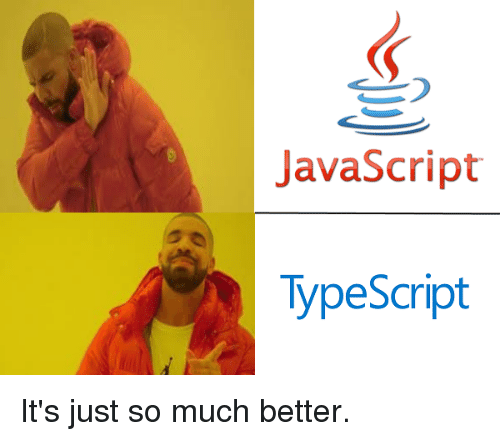

<p align="center">
  
</p>

# TypeScript

> From basic types to nominal typing — a deep dive into TypeScript's most powerful features.

---

## 📝 Description

This project is a hands-on exploration of TypeScript, covering everything from defining basic types and interfaces to working with the DOM, namespaces, declaration merging, and nominal typing. Through a series of progressively complex tasks, I built structured, type-safe code using TypeScript's full toolset — all compiled cleanly with Webpack and validated with Jest. No type errors allowed (and I mean it).

---

## 🎯 Learning Objectives

At the end of this project, I am able to work confidently with basic types in TypeScript and understand how they differ from plain JavaScript. I can define and use interfaces, classes, and functions with strong typing, and I know how to manipulate the DOM using TypeScript without losing type safety. I understand how generic types work and when to reach for them. I can organize code using namespaces and take advantage of declaration merging to extend existing interfaces across multiple files. I know how to use an ambient namespace to import an external library and provide type declarations for it. Finally, I can apply basic nominal typing techniques using brand properties to make TypeScript's structural type system behave more like a nominal one — because sometimes you really do want `MajorCredits` and `MinorCredits` to be different things, even if they look the same.

---

## 🛠️ Technologies Used

This project is built entirely in TypeScript (v4.9.5) and compiled to ES5 via Webpack (v5). I used `ts-loader` for TypeScript integration with Webpack, `ts-jest` for running tests, and `@typescript-eslint` for linting. The development environment relies on `webpack-dev-server` for live reloading, and all builds are validated to produce zero TypeScript warnings or errors.

---

## ⚙️ Requirements

- **OS:** Ubuntu 18.04 LTS
- **Language:** TypeScript — use the `.ts` extension wherever possible
- **Allowed editors:** `vi`, `vim`, `emacs`, Visual Studio Code
- All files should end with a new line
- All files will be transpiled on Ubuntu 18.04
- TypeScript scripts are checked with **Jest** (version 24.9.*)
- A `README.md` at the root of the project folder is mandatory
- The TypeScript compiler must show **no warnings or errors** when compiling your code

---

## 🚀 Installation

```bash
git clone https://github.com/GwenP88/holbertonschool-web_react
cd holbertonschool-web_react/TypeScript
```

Then, inside each task directory (e.g. `task_0`, `task_1`, etc.):

```bash
npm install
```

---

## ▶️ Usage / Execution

Each task lives in its own directory with its own configuration. To build and run a task:

### Build the project
```bash
npm run build
```

### Start the development server
```bash
npm run start-dev
```

### Run tests
```bash
npm run test
```

---

## 📊 Project Progress

<p align="center">

</p>

<p align="center">
<sub>Mandatory tasks completion: 100%</sub>
</p>

---

## ✨ Features

### Task 0 - Creating an interface for a student

- **Status:** Mandatory
- **Objective:** Define a `Student` interface with `firstName`, `lastName`, `age`, and `location` fields. Create two student objects, store them in an array, and render a dynamic HTML table using Vanilla JavaScript — all with TypeScript types enforced throughout.
- **Constraint:** Webpack must return `No type errors found`. Every variable must use TypeScript when possible.
- **Expected behavior:** A table is rendered in the browser with each student's first name and location displayed in a row.
- **Files:** `task_0/js/main.ts`, `task_0/package.json`, `task_0/.eslintrc.js`, `task_0/tsconfig.json`, `task_0/webpack.config.js`

---

### Task 1 - Let's build a Teacher interface

- **Status:** Mandatory
- **Objective:** Create a `Teacher` interface where `firstName` and `lastName` are read-only (set only at initialization), with optional `yearsOfExperience`, required `fullTimeEmployee` and `location`, and the ability to dynamically add any additional string-keyed attributes.
- **Constraint:** Webpack must return no type errors. Every variable must use TypeScript when possible.
- **Expected behavior:** A `Teacher` object can be created with any extra attributes (e.g. `contract: false`) and logged correctly to the console.
- **Files:** `task_1/js/main.ts`, `task_1/webpack.config.js`, `task_1/tsconfig.json`, `task_1/package.json`

---

### Task 2 - Extending the Teacher class

- **Status:** Mandatory
- **Objective:** Create a `Directors` interface that extends `Teacher` and requires an additional `numberOfReports` number attribute.
- **Constraint:** Must build on the `Teacher` interface from task 1.
- **Expected behavior:** A `Directors` object logs all `Teacher` fields plus `numberOfReports`.
- **Files:** `task_1/js/main.ts`

---

### Task 3 - Printing teachers

- **Status:** Mandatory
- **Objective:** Write a `printTeacher` function that takes `firstName` and `lastName` and returns the first letter of the first name followed by the full last name (e.g. `J. Doe`). Define a corresponding `printTeacherFunction` interface.
- **Constraint:** Function signature must match the interface definition.
- **Expected behavior:** `printTeacher("John", "Doe")` returns `"J. Doe"`.
- **Files:** `task_1/js/main.ts`

---

### Task 4 - Writing a class

- **Status:** Mandatory
- **Objective:** Implement a `StudentClass` with a constructor accepting `firstName` and `lastName`, a `workOnHomework()` method returning `"Currently working"`, and a `displayName()` method returning the student's first name. Both the constructor and the class itself must be described through interfaces.
- **Constraint:** No TypeScript errors on `npm run build`. All variables typed.
- **Expected behavior:** Calling `new StudentClass("Jane", "Doe").displayName()` returns `"Jane"`.
- **Files:** `task_1/js/main.ts`

---

### Task 5 - Advanced types Part 1

- **Status:** Mandatory
- **Objective:** Define `DirectorInterface` and `TeacherInterface` with three methods each. Implement `Director` and `Teacher` classes accordingly. Create a `createEmployee` function that returns a `Teacher` instance when salary is a number under 500, and a `Director` otherwise.
- **Constraint:** Salary can be either a number or a string.
- **Expected behavior:** `createEmployee(200)` → `Teacher`, `createEmployee(1000)` → `Director`, `createEmployee('$500')` → `Director`.
- **Files:** `task_2/js/main.ts`, `task_2/webpack.config.js`, `task_2/tsconfig.json`, `task_2/package.json`

---

### Task 6 - Creating functions specific to employees

- **Status:** Mandatory
- **Objective:** Write an `isDirector` type predicate function and an `executeWork` function that calls `workDirectorTasks()` or `workTeacherTasks()` depending on the employee type.
- **Constraint:** Must use type predicates properly for narrowing.
- **Expected behavior:** `executeWork(createEmployee(200))` → `"Getting to work"`, `executeWork(createEmployee(1000))` → `"Getting to director tasks"`.
- **Files:** `task_2/js/main.ts`

---

### Task 7 - String literal types

- **Status:** Mandatory
- **Objective:** Define a `Subjects` string literal type restricted to `"Math"` or `"History"`. Write a `teachClass` function that returns the appropriate teaching string based on the input.
- **Constraint:** Only `"Math"` and `"History"` are valid values for `Subjects`.
- **Expected behavior:** `teachClass('Math')` → `"Teaching Math"`, `teachClass('History')` → `"Teaching History"`.
- **Files:** `task_2/js/main.ts`

---

### Task 8 - Ambient Namespaces

- **Status:** Mandatory
- **Objective:** Create a `RowID` type and `RowElement` interface in `interface.ts`. Write ambient type declarations for a third-party `crud.js` library in `crud.d.ts`. Use triple slash directives and ambient imports in `main.ts` to interact with the CRUD library in a type-safe way.
- **Constraint:** No TypeScript errors on build. All variables typed. The ambient file must import types from the interface file.
- **Expected behavior:** Insert, update, and delete rows are logged with correct types and values.
- **Files:** `task_3/js/main.ts`, `task_3/js/interface.ts`, `task_3/js/crud.d.ts`

---

### Task 9 - Namespace & Declaration merging

- **Status:** Mandatory
- **Objective:** Create a `Subjects` namespace across multiple files using declaration merging. Implement a `Teacher` interface, a base `Subject` class, and three subject classes (`Cpp`, `React`, `Java`) — each extending `Teacher` with an optional experience attribute and implementing `getRequirements()` and `getAvailableTeacher()` methods.
- **Constraint:** All files share the same `Subjects` namespace; declaration merging must be used to extend the `Teacher` interface.
- **Expected behavior:** Each subject class correctly reports requirements and available teacher, returning `"No available teacher"` when experience is missing.
- **Files:** `task_4/js/subjects/Teacher.ts`, `task_4/js/subjects/Subject.ts`, `task_4/js/subjects/Cpp.ts`, `task_4/js/subjects/React.ts`, `task_4/js/subjects/Java.ts`

---

### Task 10 - Brand convention & Nominal typing

- **Status:** Mandatory
- **Objective:** Create `MajorCredits` and `MinorCredits` interfaces — each with a `credits` number and a unique brand property — to simulate nominal typing in TypeScript's structural type system. Implement `sumMajorCredits` and `sumMinorCredits` functions that sum the credits of two subjects and return the correctly branded type.
- **Constraint:** Brand properties must make the two interfaces structurally incompatible.
- **Expected behavior:** `sumMajorCredits` returns a `MajorCredits` object; `sumMinorCredits` returns a `MinorCredits` object. They cannot be mixed up at compile time.
- **Files:** `task_5/js/main.ts`, `task_5/package.json`, `task_5/webpack.config.js`, `task_5/tsconfig.json`

---

## 🤝 Contributions & Acknowledgements

Big thanks to the Holberton School staff and peers who reviewed code, answered late-night TypeScript questions, and reminded me that `noImplicitAny: true` is there for a reason (even when it's painful). This project would have been a lot messier without the TypeScript documentation and the collective suffering of everyone who has ever debugged a `ts-loader` Webpack config.

---

## 👤 Author

**Gwenaelle PICHOT**
- Student at Holberton School
- Track: Web React
- Project: TypeScript
- GitHub: [@GwenP88](https://github.com/GwenP88)